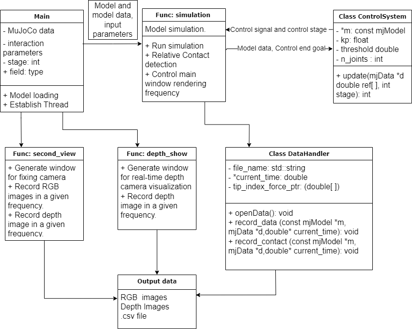

# MuJoCo Capability

MuJoCo Capability is a simulation framework designed to facilitate rapid development and study using the MuJoCo physics engine. This project aims to streamline experimental setups and provide tools for in-depth analysis of object manipulation with dexterous hands and control strategies.

## Description

This framework provides a suite of functionalities for interacting with the MuJoCo physics engine, including integrated simulation control, data logging, and advanced visualization tools. It is intended for researchers and engineers in the field of robotics who require a robust and flexible simulation environment.
## Software Structure

## Getting Started

### Dependencies

- MuJoCo 2.3.7 
- Python 3.8 
- Compatible with Ubuntu 20.04

### Installing

Clone the repository to your local machine:
Inside the Folder of mujoco-2.3.7 
```bash
mkdir Project
cd Project
git clone https://github.com/SpriteDu/MuJoCo_Capability.git

cd muJoCo_capability
cd build
cmake .
make InteractionPro
./IntereactionPro ../models/franka_panda_RH8D_R.xml Record
cd ../src/
python simple_plot.py ../build/Record.csv 
code ./ControlSystem.cpp 
```
You can Modify the Controller 
For different grasping method
Build and use RecordPro
```bash
cd ../build/
make RecordPro
./RecordPro ../models/franka_panda_RH8D_R_Prism.xml 20 New_Record rgb.out depth.out 300 300 true 40
ffmpeg -f rawvideo -pixel_format rgb24 -video_size 300x300   -framerate 20 -i rgb.out -vf "vflip" rgb.mp4
ffmpeg -f rawvideo -pixel_format rgb24 -video_size 300x300   -framerate 20 -i depth.out -vf "vflip" depth.mp4
```


